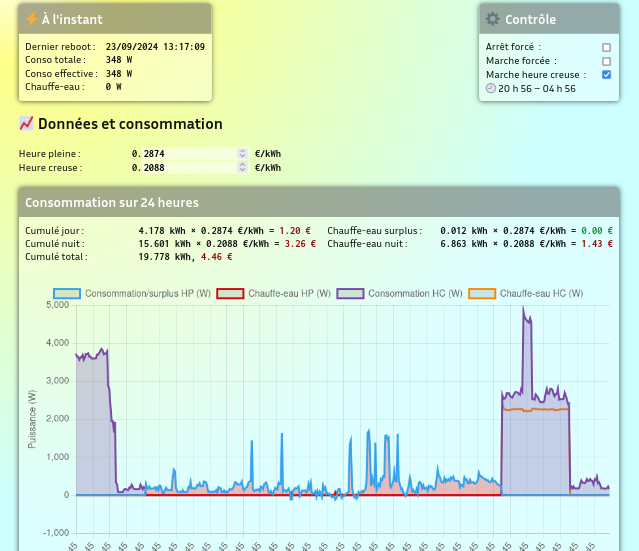

.. |ss| raw:: html

  <strike>

.. |se| raw:: html

  </strike>

English below.

FRANÇAIS
=========

Lisez-moi
---------

Programme de routeur solaire pour ESP32 pour rediriger un
surplus de production vers par exemple un chauffe-eau. Cela
comprend :

* la mise à jour du programme par WiFi (over-the-air, OTA) ;
* WebSerial, un port série par web pour accéder à la
  journalisation sur http://x.x.x.x/webserial ;
* une correction du transfert de puissance suivant un profil
  arcsin pour compenser les thyristors mal calibrés ou un
  évenuel décalage de phase (typiquement : un thyristor
  ouvert à 10 % de 2400 W qui ne délivre que 30 W) ;
* gestion des heures creuses sans nécessiter de relai de
  marche forcée ;
* information sur écran avec écran de chargement (mon chat),
  l'heure, l'affichage de la consommation du foyer si le
  chauffe-eau n'est pas alimenté, ou, de la consommation
  réelle du chauffe-eau en cas de surplus, mesurée par une
  sonde JSY-MK-194 ;
* graphe des dernières 15 minutes et 24 heures de la conso
  générale et de l'appareil avec `Chart.js
  <https://chartjs.org>`_ ;
* code découpé en tâches permettant une bonne séparation des
  différents modules basé sur le principe de responsabilité
  unique (*sole responsability principle*, même si j'avoue
  que ça pourrait être plus poussé) ;
* également découpé en .h et .cpp, ce qui a l'air d'être
  assez rare dans la communauté Arduino, ça divise
  quand-même quasiment les temps de compilation par trois ;
* une convention de nommage étrange en franglais mais qui je
  l'éspère permet d'être comprise par les néophytes de la
  programmation.

À faire
-------

* |ss| Suppression de ArduinoJSON. |se|
* |ss| Refactor du code pour les graphiques, trop de duplication.
  |se|
* [PEUT-ÊTRE] Reproduction de l'écran.
* [PEUT-ÊTRE] Gestion du ventilateur du thyristor (peut-être
  ; j'ai mesuré au maximum une température de 28 °C sur le
  gros radiateur équippé lorsque le chauffe-eau tirait 2400
  W).

Notes
-----

Il est important d'augmenter la taille de la queue
asynchrone dans dans la bibliothèque `AsyncTCP`, sinon le
chien de garde risque d'attendre trop longtemps la tâche et
va rebooter la machine.

Pour ce faire j'ai modifié dans la bibliothèque le fichier
`AsyncTCP.cpp:98`, remplaçant par::

  _async_queue = xQueueCreate(1024, sizeof(lwip_event_packet_t *));

Mieux encore, à partir de cette version j'utilise le `fork
de Mathieu Carbou
<https://registry.platformio.org/libraries/mathieucarbou/ESPAsyncWebServer>`_
pour les bibliothèques AsyncTCP et ESPAsyncWebServer.
L'API ne change (quasiment) pas, le serveur est beaucoup
plus stable et le chien de garde est content. Enfin, presque.
Faut que je mette en place les *chunked responses*.

Licence
-------

Voir le fichier LICENSE. En gros, vous faites ce que vous
voulez de ce logiciel tant que vous ne vous en servez-pas
dans un cadre capitaliste.

Aide
----

Vous pouvez faire un don quelque soit le montan
`page Ko-Fi <https://ko-fi.com/eprivat/goal?g=0>`_ ça
m'aiderait énormément, si vous en avez les moyens.

ENGLISH
=======

Readme
------

Solar router program for ESP32 to redirect any
overproduction to say a water-heater, including:

* WiFi Over-the-air (OTA);
* WebSerial, a serial port over WiFi to access log
  information at http://x.x.x.x/webserial;
* corrected thyristor transfer function (of the form arcsin)
  to compensate badly calibrated devices or phase shifts
  between tension and current, e.g. a 10% closed thyristor
  wich would only provide 30 W instead of 240 W for a 2400 W
  device;
* off-peak hours handling (« *heures creuses* ») to override
  solar (non-)production at night or whenever without the
  need of a relay;
* screen info with loading splash screen (my cat), time,
  ip address, and displaying the actual consumption of the
  household if not powering the water-heater, or the actual
  (as in measured by a JSY-MK-194) power taken by the
  water-heater;
* Plot of the last 15 minutes and 24 hours of the total and
  device consumption using `Chart.js
  <https://chartjs.org>`_;
* task oriented code allowing good isolation of code modules
  (sole responsability principle, could be better I admit)
  and using all cores of any FreeRTOS based device;
* and separated in cpp and header files, it seems rare in
  the Arduino community but it divides the compilation time
  almost by three;
* weird frenglish names convention from trying to have good
  code while having understandable file and function names
  for non programmers.

Todo
----

* |ss| Remove ArduinoJSON. |se|
* [ss| Refactoring the code for the charts, too much duplication.
  |se|
* [MAYBE] Screen reproduction.
* [MAYBE] Fan control. Not needed right now, the maximum
  temperature I measured on the thyristor (equipped with a
  big radiator) is 28 °C (82 °F) while delivering 2400 W.

Notes
-----

Depending on your setup it might be important to increase
the async tcp queue. I had problems with the esp32 rebooting
because of the watchdog being impatient on `AsyncTCP`.

In the library file `AsyncTCP.cpp:98` I modified the
initialization of the queue as such::

  _async_queue = xQueueCreate(1024, sizeof(lwip_event_packet_t *));

Even better, for now on I use `Mathieu Carbou's fork
<https://registry.platformio.org/libraries/mathieucarbou/ESPAsyncWebServer>`_
of AsyncTCP and ESPAsyncWebServer. The API is (almost
exactly) the same and the server is way more stable for a
happy watchdog. Well, almost, need to work on chunked responses.

License
-------

See LICENSE file. To recap, you do whatever you want if you
are not using it as part of a capitalist organisation.

Can I help?
-----------

Please take a look at my
`Ko-Fi page <https://ko-fi.com/eprivat/goal?g=0>`_, and
consider tipping if you can afford it, that would help
enormously.
